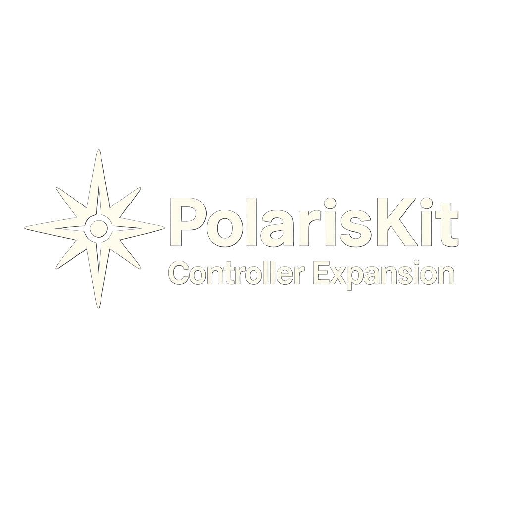

  

# 🎮 PolarisKit Controller Expansion  
_Add seamless controller support to your PolarisKit games_

The **Controller Expansion** is a plug-and-play add-on for **PolarisKit**, giving your Pygame projects built-in gamepad support with clean input handling and mappings. Whether you're making arcade games, platformers, or twin-stick shooters, this module helps you get controller support up and running in minutes.

---

## ⚡ Features

- ✅ Drop-in `controller_manager.py` for controller abstraction  
- 🎮 Supports Xbox, PS5, and generic gamepads (via SDL2)  
- 🔁 Automatic fallback to keyboard when no controller is connected  
- 🔧 Easily map buttons and axes per scene  
- 🧱 PolarisKit-style modular integration  
- 📄 README integration guide included  

---

## 📁 What's Included

- `controller_manager.py` – Main module for detecting and handling controller input  
- `controller_config.py` – Button/axis mapping templates  
- `controller_test_scene.py` – Optional test scene to validate setup  
- `README.md` – Full integration instructions  

---

## 🔧 Setup & Usage

1. **Copy `controller_manager.py`** into your PolarisKit project  
2. Import and initialize it in your `SceneBase` or individual scenes  
3. Use `get_button("jump")`, `get_axis("move_x")`, etc. in your update loop  
4. Customize your mappings via `controller_config.py` if needed  

---

## 🧩 Compatibility

- Requires PolarisKit v3.0 or later  
- Python 3.8+  
- Pygame 2.x (SDL2 backend)  

---

## 🧪 Dev Notes

This expansion is powered by **PolarisKit** it does not overwrite PolarisKit’s keyboard handling. Instead, it **extends it** with controller-aware inputs that mirror your existing input logic.

---

## 💬 Need Help?

This expansion is part of the **PolarisKit ecosystem**, built by developers for developers. If you're stuck, feel free to reach out:

📫 [LinkedIn](https://www.linkedin.com/in/marco-a-gonzalez99)  
💻 [GitHub](https://github.com/marcogonzalez99)

---

## 🏷️ Licensing & Access

> This expansion is part of a **paid toolkit** under **SB Studios**.  
> For access, visit the [Ko-fi Store](https://ko-fi.com/sbstudios) or inquire via LinkedIn.

---

## 🧊 Built By

Marco @ **SB Studios**  
[GitHub](https://github.com/marcogonzalez99) · [LinkedIn](https://www.linkedin.com/in/marco-a-gonzalez99)
